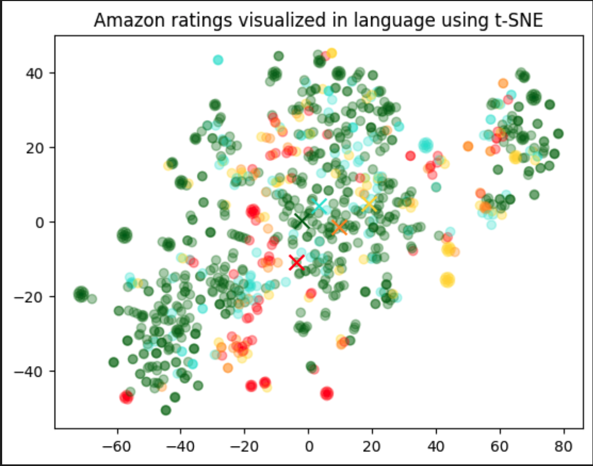

# Visualizing embeddings in 2D

Daten werden aus einer CSV-Datei extrahiert und die Datenwolke mittels SNE-Diagramm ausgegeben.
Eine gute Anwendung zur **Visualisierung von Datenwolken**, die man sehr brauchbar mit OpenAI Abfragen zur Visualisierung der Daten verknüpfen kann.

